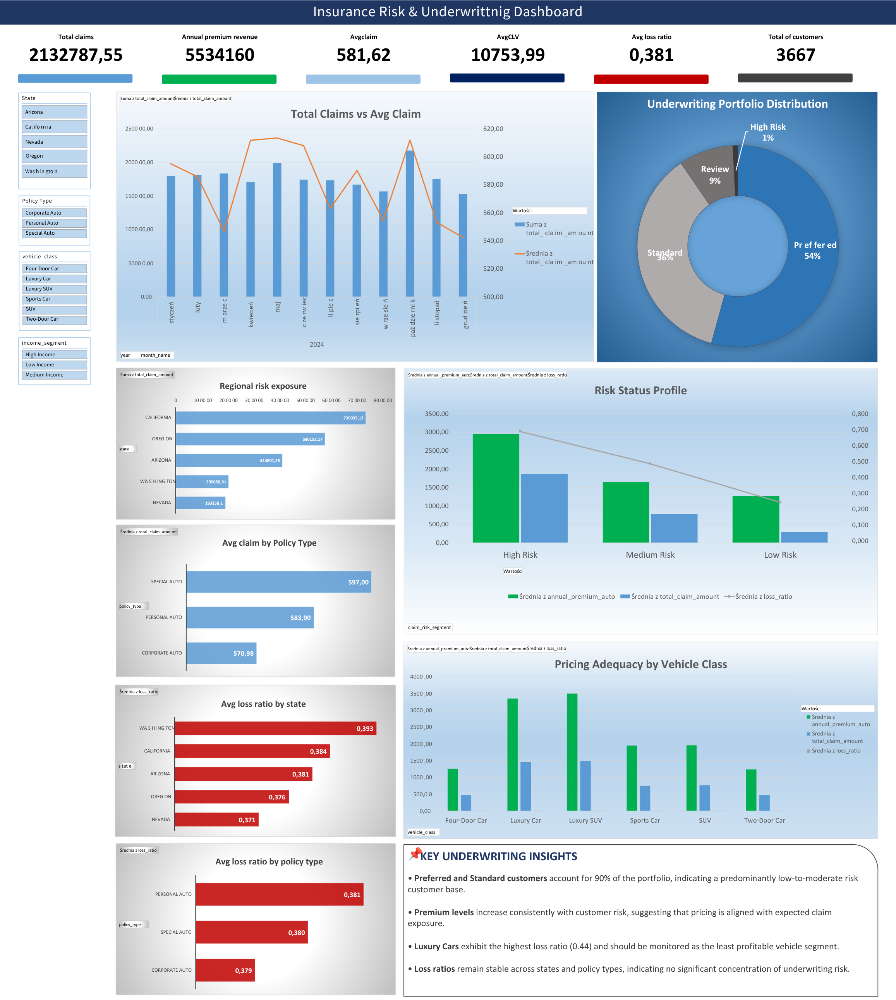

# Insurance Risk & Underwriting Dashboard

## Project Overview

This project analyzes an auto insurance portfolio using Excel, Power Query, Pivot Tables, and interactive dashboarding.

The objective was to evaluate underwriting performance, pricing adequacy, and customer risk segmentation across vehicle classes, policy types, and geographic regions.

## Data Source

The dataset used in this project is a publicly available insurance dataset obtained from Kaggle and was used solely for educational and portfolio purposes.

Source: https://www.kaggle.com/

The data does not contain any confidential or proprietary information related to my current or previous employers.

## Tools Used

* Microsoft Excel
* Power Query
* Pivot Tables
* KPI Reporting
* Interactive Slicers
* Dashboard Design

## Data Preparation / ETL Process

The raw dataset was imported and transformed using Power Query. The preparation process included:

* Cleaning and standardizing column names
* Correcting data types
* Removing unnecessary encoded index columns
* Filtering incomplete reporting periods
* Creating analytical fields used in the dashboard

Additional calculated fields were created to support underwriting analysis, including:

* Annual Premium
* Loss Ratio
* Customer Risk Status
* Income Segment
* Monthly Trend Dimensions

## Dashboard Preview

## Analytical Approach

The analysis was focused on evaluating whether premium pricing is aligned with claim exposure and customer risk.

The dashboard compares premiums, claims, loss ratios, and customer segments across multiple business dimensions such as:

* Vehicle Class
* Policy Type
* State
* Income Segment
* Risk Segment

The project combines portfolio-level KPI reporting with underwriting-specific metrics to support business interpretation rather than simply visualizing raw values.

## Key Metrics

* Total Claims
* Annual Premium Revenue
* Average Claim Amount
* Average Customer Lifetime Value (CLV)
* Average Loss Ratio
* Total Customers

## Key Underwriting Insights

* Preferred and Standard customers account for 90% of the portfolio, indicating a predominantly low-to-moderate risk customer base.
* Premium levels increase consistently with customer risk, suggesting that pricing is aligned with expected claim exposure.
* Luxury Cars exhibit the highest loss ratio and should be monitored as the least profitable vehicle segment.
* Loss ratios remain stable across states and policy types, indicating no significant concentration of underwriting risk.
* High Risk customers remain below a 1.0 loss ratio threshold, suggesting that current pricing adequately compensates for elevated risk.

## Business Questions Answered

* Is premium pricing aligned with risk exposure?
* Which vehicle classes generate the highest claims?
* Are there geographic concentrations of underwriting risk?
* How does risk vary across customer segments?
* Is the insurance portfolio profitable from an underwriting perspective?

## Dashboard Features

* Executive KPI cards
* Monthly claims trend analysis
* Underwriting portfolio distribution
* Risk status profile
* Pricing adequacy by vehicle class
* Geographic loss ratio analysis
* Interactive slicers
* Executive insights section

## Skills Demonstrated

* Data Cleaning & Transformation
* ETL with Power Query
* KPI Development
* Dashboard Design
* Risk Segmentation
* Loss Ratio Analysis
* Business Intelligence Reporting
* Business Insight Generation
* Executive Reporting
